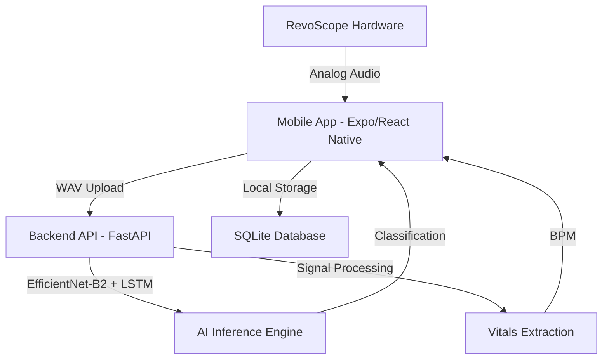

# RevoScope: Volunteer-Led AI Diagnostic Suite 🚑🩺

**LifeLines Hackathon 2026** | **Problem Statement:** HPS#3 - AI-Augmented Emergency Triage

RevoScope is a force-multiplier for frontline clinics in high-casualty crisis events. It's a comprehensive diagnostic platform designed for use by volunteers and non-medical staff to perform rapid, AI-augmented heart-and-lung scans for effective patient triage.

---

## 🚩 The Problem: The "Expert Gap"
In disasters (earthquakes, floods, conflict), doctors are overwhelmed. Critical time is lost while patients wait for an initial screening. RevoScope bridges this gap by empowering volunteers with expert-level diagnostic tools.

## 💡 The Solution: AI-Powered Triage
RevoScope combines a low-cost hardware acoustic sensor with a sophisticated AI backend to classify respiratory pathologies and measure vitals in under 30 seconds.

---

## 🏗️ Architecture & Tech Stack

### System Overview


### Technology Stack
- **Frontend**: React Native (Expo), NativeWind (Tailwind CSS), React Navigation, Expo-AV, Expo-SQLite.
- **Backend**: Python 3.9+, FastAPI, PyTorch (TorchVision), Librosa (Audio Processing), NumPy, Pandas.
- **AI Model**: Optimized EfficientNet-B2 backbone combined with an LSTM layer and Attention mechanism for temporal audio feature analysis.

---

## ✨ Key Capabilities

### 1. 🧠 AI Lung Pathology Detection
The system uses a Convolutional Neural Network (CNN) to detect:
- **Pneumonia & Infection**: Fine/Coarse Crackles.
- **Asthma & Airway Distress**: Wheezing.
- **Trauma-Induced Lung Collapse**: Absence of breath sounds.
- **Bronchitis**: Rhonchi.

### 2. 💓 Integrated Heart Rate (BPM)
Digital signal processing extracts BPM from the acoustic recording:
- **Bandpass Filtering**: Isolates the 20Hz–150Hz heart sound range.
- **Peak Detection**: Calculates real-time BPM to detect shock (Tachycardia/Bradycardia).

### 3. 🚦 Automated Triage Ranking (ESI-Based)
The app provides immediate, color-coded priority based on the Emergency Severity Index:
- 🔴 **RED (Critical)**: Life-threatening sounds or extreme heart rate.
- 🟡 **YELLOW (Observation)**: Issues detected (e.g., wheezing). Queue for review.
- 🟢 **GREEN (Stable)**: Normal vitals.

---

## 📁 Repository Structure
```text
.
├── backend/                # FastAPI Server
│   ├── api_server.py       # Main API entry point
│   ├── requirements.txt    # Python dependencies
│   └── weights/            # Trained model weights
├── src/                    # Mobile App Source
│   ├── components/         # UI Components
│   ├── screens/            # App Screens (Triage, Patient List, etc.)
│   ├── services/           # ApiService & DatabaseService
│   ├── context/            # Global state management
│   └── assets/             # Static assets
├── App.js                  # App entry point
└── package.json            # NPM dependencies
```

---

## 🚀 Getting Started

### Prerequisites
- **Node.js**: v18+ (for the frontend)
- **Python**: v3.10+ (for the backend)
- **Git LFS**: Required for downloading the AI model weights.
- **Expo Go**: Install on your iOS/Android device to test hardware scanning.

### 📥 First Time Setup (Cloning)
If you have just cloned the repository, you **must** pull the large AI model weights using Git LFS:
```bash
# 1. Install & Initialize Git LFS
git lfs install

# 2. Download the actual AI model weights (approx 300MB)
git lfs pull
```
*The weights are located at `backend/weights/respiratory_ast_best.pth`.*

### 🛠️ Step 1: Start the AI Backend
Open a terminal in the `backend/` directory:
```bash
cd backend

# Create and activate virtual environment
python -m venv venv
source venv/bin/activate  # On Windows: venv\Scripts\activate

# Install dependencies
pip install -r requirements.txt

# Run the AST-optimized server
python api_server.py
```
*Wait until you see: **"✓ AST model loaded"***. The API will be available at `http://localhost:8000`.

### 📱 Step 2: Start the Frontend
Open a **new** terminal in the root project folder:
```bash
# Install dependencies
npm install

# Start the Expo app
npx expo start
```
- Press **'s'** to switch to Expo Go mode if needed.
- Scan the QR code with your phone (using Expo Go) or run on an emulator.

---

## 🛠️ The Hardware: RevoScope
The RevoScope is an original, low-cost ($<10 USD) acoustic sensor:
- **Components**: High-sensitivity capacitive microphone + 3D-printed acoustic chamber.
- **Design**: Optimized for digital sensors rather than human ears, providing cleaner data for the AI.

---

## 🗺️ Roadmap
- [ ] **Native Mobile Integration**: Direct smartphone sensor access.
- [ ] **Offline Inference**: Porting the AI model to ONNX/TensorFlow Lite for on-device analysis.
- [ ] **Geospatial Mapping**: Visualizing disease "hot spots" for aid organizations.
- [ ] **Multi-Language Support**: Localizing the interface for diverse global responders.

---
---

## 📡 API Endpoints

### POST `/analyze`
Uploads an audio file for classification.
- **Response**: JSON containing class prediction, confidence scores, severity score, and ESI recommendation.

### GET `/health`
Health check endpoint. Returns model loading status, accuracy, and current device (MPS/CUDA/CPU).

---

## 🧠 Model Architecture
- **Model**: Audio Spectrogram Transformer (AST)
- **Base**: `MIT/ast-finetuned-audioset-10-10-0.4593`
- **Fine-tuning**: Custom classification head (Linear Layer)
- **Input**: Normalized 510-length spectrogram sequences
- **Output**: 4 classes (Normal, Crackle, Wheeze, Both)
- **Performance**: Optimized for Apple Silicon (MPS) with ~0.1-0.3s inference latency.

---
© 2026 RevoScope Team | LifeLines Hackathon

