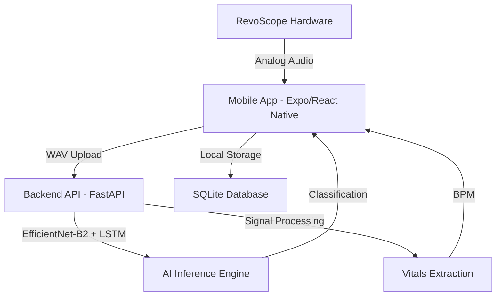

# RevoScope: Volunteer-Led AI Diagnostic Suite 🚑🩺

**LifeLines Hackathon 2026** | **Problem Statement:** HPS#3 - AI-Augmented Emergency Triage

RevoScope is a force-multiplier for frontline clinics in high-casualty crisis events. It's a comprehensive diagnostic platform designed for use by volunteers and non-medical staff to perform rapid, AI-augmented heart-and-lung scans for effective patient triage.

---

## 🚩 The Problem: The "Expert Gap"
In disasters (earthquakes, floods, conflict), doctors are overwhelmed. Critical time is lost while patients wait for an initial screening. RevoScope bridges this gap by empowering volunteers with expert-level diagnostic tools.

## 💡 The Solution: AI-Powered Triage
RevoScope combines a low-cost hardware acoustic sensor with a sophisticated AI backend to classify respiratory pathologies and measure vitals in under 30 seconds.

---

## 🏗️ Architecture & Tech Stack

### System Overview


### Technology Stack
- **Frontend**: React Native (Expo), NativeWind (Tailwind CSS), React Navigation, Expo-AV, Expo-SQLite.
- **Backend**: Python 3.9+, FastAPI, PyTorch (TorchVision), Librosa (Audio Processing), NumPy, Pandas.
- **AI Model**: Optimized EfficientNet-B2 backbone combined with an LSTM layer and Attention mechanism for temporal audio feature analysis.

---

## ✨ Key Capabilities

### 1. 🧠 AI Lung Pathology Detection
The system uses a Convolutional Neural Network (CNN) to detect:
- **Pneumonia & Infection**: Fine/Coarse Crackles.
- **Asthma & Airway Distress**: Wheezing.
- **Trauma-Induced Lung Collapse**: Absence of breath sounds.
- **Bronchitis**: Rhonchi.

### 2. 💓 Integrated Heart Rate (BPM)
Digital signal processing extracts BPM from the acoustic recording:
- **Bandpass Filtering**: Isolates the 20Hz–150Hz heart sound range.
- **Peak Detection**: Calculates real-time BPM to detect shock (Tachycardia/Bradycardia).

### 3. 🚦 Automated Triage Ranking (ESI-Based)
The app provides immediate, color-coded priority based on the Emergency Severity Index:
- 🔴 **RED (Critical)**: Life-threatening sounds or extreme heart rate.
- 🟡 **YELLOW (Observation)**: Issues detected (e.g., wheezing). Queue for review.
- 🟢 **GREEN (Stable)**: Normal vitals.

---

## 📁 Repository Structure
```text
.
├── backend/                # FastAPI Server
│   ├── api_server.py       # Main API entry point
│   ├── requirements.txt    # Python dependencies
│   └── weights/            # Trained model weights
├── src/                    # Mobile App Source
│   ├── components/         # UI Components
│   ├── screens/            # App Screens (Triage, Patient List, etc.)
│   ├── services/           # ApiService & DatabaseService
│   ├── context/            # Global state management
│   └── assets/             # Static assets
├── App.js                  # App entry point
└── package.json            # NPM dependencies
```

---

## 🚀 Getting Started

### Prerequisites
- Node.js (v18+)
- Python (v3.9+)
- Expo Go app on your mobile device (to test hardware integration)

### Backend Setup
1. Navigate to the backend directory:
   ```bash
   cd backend
   ```
2. Create and activate a virtual environment:
   ```bash
   python -m venv venv
   source venv/bin/activate  # On Windows: venv\Scripts\activate
   ```
3. Install dependencies:
   ```bash
   pip install -r requirements.txt
   ```
4. Run the server:
   ```bash
   python api_server.py
   ```
   *The API will be available at `http://localhost:8000`*

### Frontend Setup
1. Install NPM dependencies:
   ```bash
   npm install
   ```
2. Update the API URL:
   Edit `src/services/ApiService.js` and change `API_BASE_URL` to your local machine's IP address if testing on a physical device.
3. Start the Expo development server:
   ```bash
   npx expo start
   ```

---

## 🛠️ The Hardware: RevoScope
The RevoScope is an original, low-cost ($<10 USD) acoustic sensor:
- **Components**: High-sensitivity capacitive microphone + 3D-printed acoustic chamber.
- **Design**: Optimized for digital sensors rather than human ears, providing cleaner data for the AI.

---

## 🗺️ Roadmap
- [ ] **Native Mobile Integration**: Direct smartphone sensor access.
- [ ] **Offline Inference**: Porting the AI model to ONNX/TensorFlow Lite for on-device analysis.
- [ ] **Geospatial Mapping**: Visualizing disease "hot spots" for aid organizations.
- [ ] **Multi-Language Support**: Localizing the interface for diverse global responders.

---
© 2026 RevoScope Team | LifeLines Hackathon

