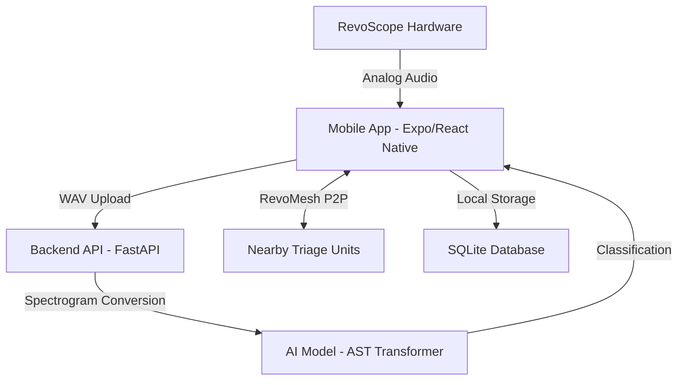

# RevoScope: Volunteer-Led AI Diagnostic Suite 🚑🩺

**LifeLines Hackathon 2026** | **Problem Statement:** HPS#3 - AI-Augmented Emergency Triage

RevoScope is a force-multiplier for frontline clinics in high-casualty crisis events. It's a comprehensive diagnostic platform designed for use by volunteers and non-medical staff to perform rapid, AI-augmented heart-and-lung scans for effective patient triage.

---

## 🚩 The Problem: The "Expert Gap"
In disasters (earthquakes, floods, conflict), doctors are overwhelmed. Critical time is lost while patients wait for an initial screening. RevoScope bridges this gap by empowering volunteers with expert-level diagnostic tools.

## 💡 The Solution: AI-Powered Triage
RevoScope combines a low-cost hardware acoustic sensor with a sophisticated AI backend to classify respiratory pathologies and measure vitals in under 15 seconds.

---

## 🏗️ Architecture & Tech Stack

### System Overview


### Technology Stack
- **Frontend**: React Native (Expo), NativeWind (Tailwind CSS), React Navigation, Expo-AV, Expo-SQLite.
- **Backend**: Python 3.9+, FastAPI, PyTorch, Librosa (Audio Processing).
- **AI Model**: **Audio Spectrogram Transformer (AST)** (`MIT/ast-finetuned-audioset-10-10-0.4593`) fine-tuned for respiratory sound classification.

---

## ✨ Key Capabilities

### 1. 🧠 Advanced AI Diagnostics (AST)
Unlike traditional CNNs, RevoScope uses a Transformer-based architecture (AST) to analyze temporal audio patterns. It detects:
- **Pneumonia & Infection**: Crackles (Fine/Coarse).
- **Asthma & Airway Distress**: Wheezing.
- **Normal Vitals**: Healthy vesicular breath sounds.
- **Complex Pathologies**: Mixed features (Crackles + Wheezes).

### 2. � RevoMesh: Offline Peer Sync (Simulated)
Designed for grid-down scenarios, RevoScope includes a "RevoMesh" simulation. This feature demonstrates how devices can automatically sync patient data with nearby peer units via Bluetooth Low Energy (BLE) without needing internet access, ensuring continuity of care across field hospitals.

### 3. 🧪 Developer & Demo Mode
Includes a robust set of demonstration tools for judges and testing:
- **Random Patient Generator**: Instantly populate intake forms with realistic diverse personas.
- **Forced Result Injection**: Manually trigger specific diagnoses (Normal/Crackles/Wheezing) to verify UI responses and Triage logic without needing a physical patient.
- **Heart Rate Simulation**: Simulates heart rate detection from breath sounds (PCG).

### 4. 🚦 Automated Triage Ranking (ESI-Based)
The app provides immediate, color-coded priority based on the **Emergency Severity Index (ESI)**:
- 🔴 **ESI 1-2 (Critical/Urgent)**: Severe distress, airway compromise (Wheezing/Crackles + Low Confidence).
- 🟡 **ESI 3 (Moderate)**: Abnormal sounds necessitating treatment (Crackles/Wheezing).
- 🟢 **ESI 4-5 (Stable)**: Normal findings or mild issues.

---

## 📁 Repository Structure
```text
.
├── backend/                # FastAPI Server & AI Model
│   ├── api_server.py       # Main API entry point (AST Model)
│   ├── weights/            # Model weights storage
│   └── requirements.txt    # Python dependencies
├── src/                    # Mobile App Source
│   ├── components/         # UI Components (Cards, Charts)
│   ├── screens/            # App Screens (Dashboard, Intake, Scan)
│   ├── services/           # ApiService, DatabaseService
│   ├── context/            # Global App State
│   └── assets/             # Images & Icons
├── App.js                  # App entry point
└── package.json            # NPM dependencies
```

---

## 🚀 Getting Started

### Prerequisites
- **Node.js**: v18+ (for the frontend)
- **Python**: v3.10+ (for the backend)
- **Git LFS**: Required for downloading the large AI model weights.
- **Expo Go**: Install on your iOS/Android device to test hardware scanning.

### 📥 First Time Setup (Cloning)
If you have just cloned the repository, you **must** pull the large AI model weights using Git LFS:
```bash
# 1. Install & Initialize Git LFS
git lfs install

# 2. Download the actual AI model weights (approx 300MB)
git lfs pull
```
*The weights are located at `backend/weights/respiratory_ast_best.pth`.*

### 🛠️ Step 1: Start the AI Backend
Open a terminal in the `backend/` directory:
```bash
cd backend

# Create and activate virtual environment
python -m venv venv
source venv/bin/activate  # On Windows: venv\Scripts\activate

# Install dependencies (Torch, Transformers, FastAPI)
pip install -r requirements.txt

# Run the AST-optimized server
python api_server.py
```
*Wait until you see: **"✓ AST Model loaded successfully"***. The API will be available at `http://localhost:8000`.

### 📱 Step 2: Start the Frontend
Open a **new** terminal in the root project folder:
```bash
# Install dependencies
npm install

# Start the Expo app
npm run web  # For web preview
# OR
npx expo start # For mobile (Scan QR with Expo Go)
```

---

## 🛠️ The Hardware: RevoScope
The RevoScope is an original, low-cost ($<10 USD) acoustic sensor:
- **Components**: High-sensitivity capacitive microphone + 3D-printed acoustic chamber.
- **Design**: Optimized for digital sensors rather than human ears, providing cleaner data for the AI.

---

## 🗺️ Roadmap
- [ ] **Real-time RevoMesh**: Implementation of the actual Bluetooth Mesh protocol (currently simulated).
- [ ] **Edge Inference**: Porting the AST model to ONNX Runtime for fully offline on-device inference.
- [ ] **Geospatial Hotspots**: Mapping disease clusters for aid worker logistics.

---

## 📡 API Endpoints

### POST `/analyze`
Uploads an audio file (`.wav`) for classification.
- **Response**: JSON containing diagnosis, confidence, severity score, and ESI triage recommendation.

### GET `/health`
Health check endpoint. Returns model status and compute device (MPS/CUDA/CPU).

---

© 2026 RevoScope Team | LifeLines Hackathon
